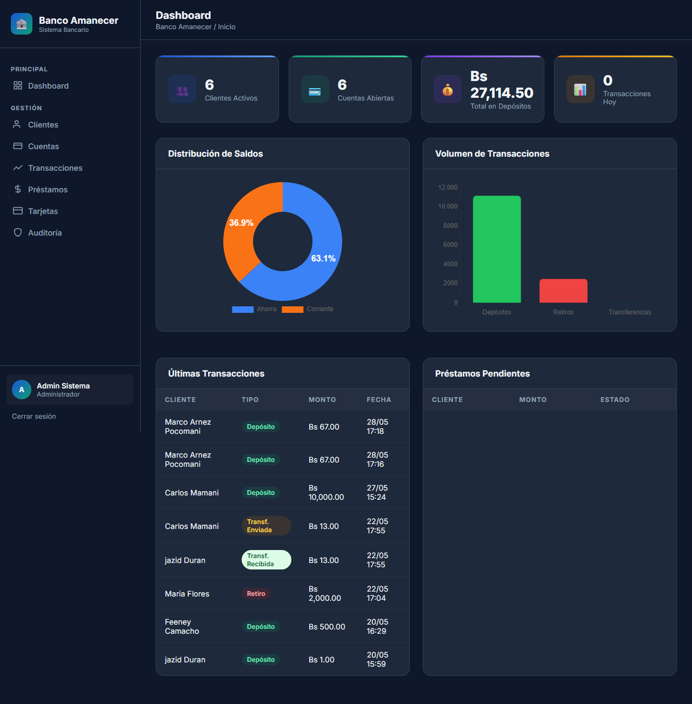
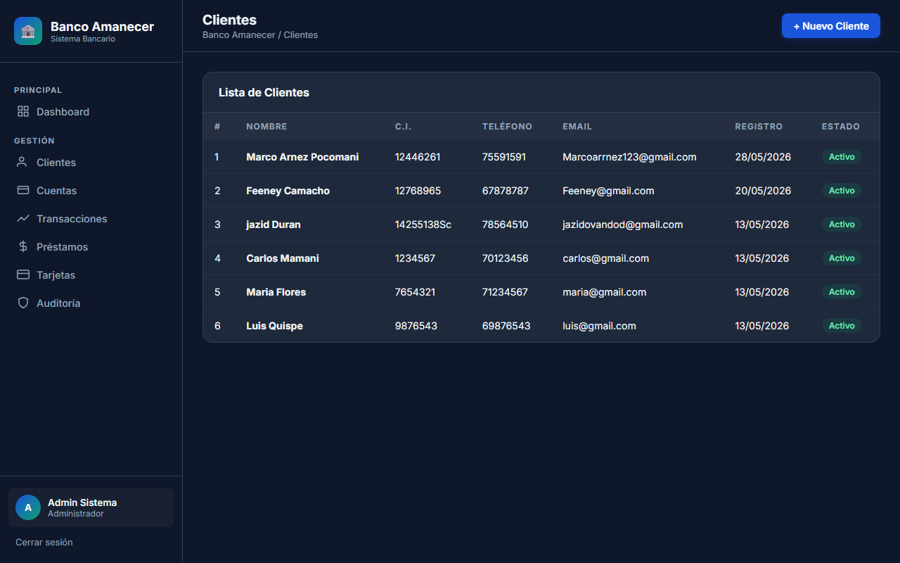
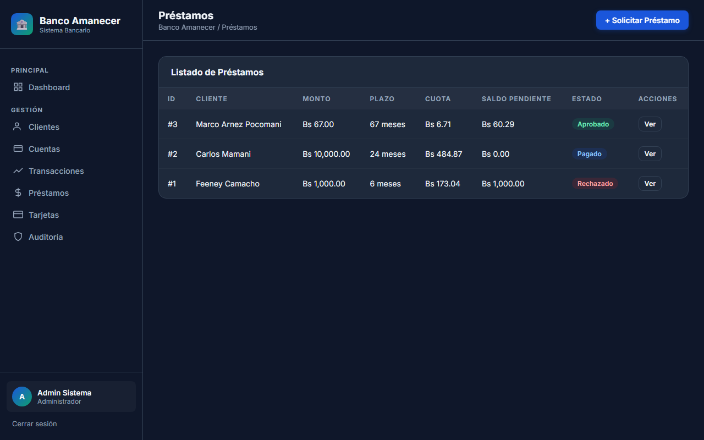
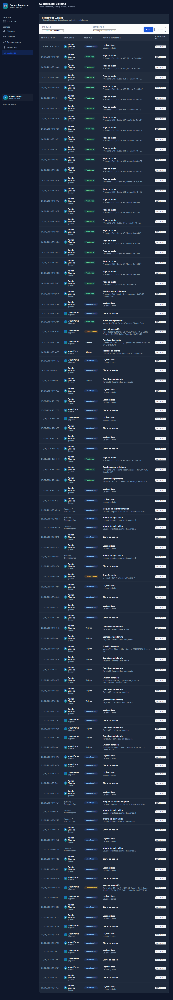
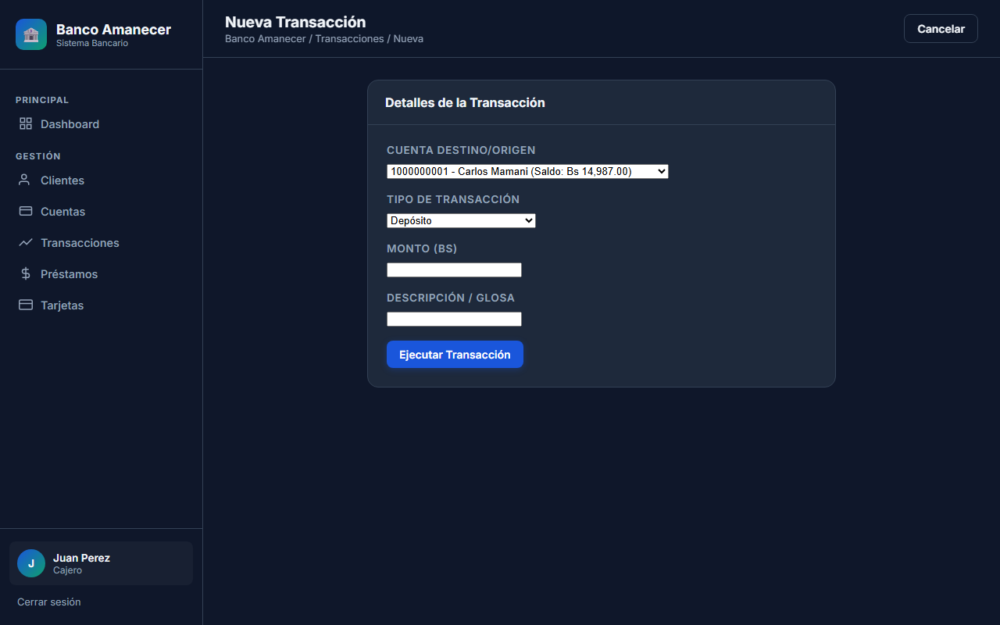
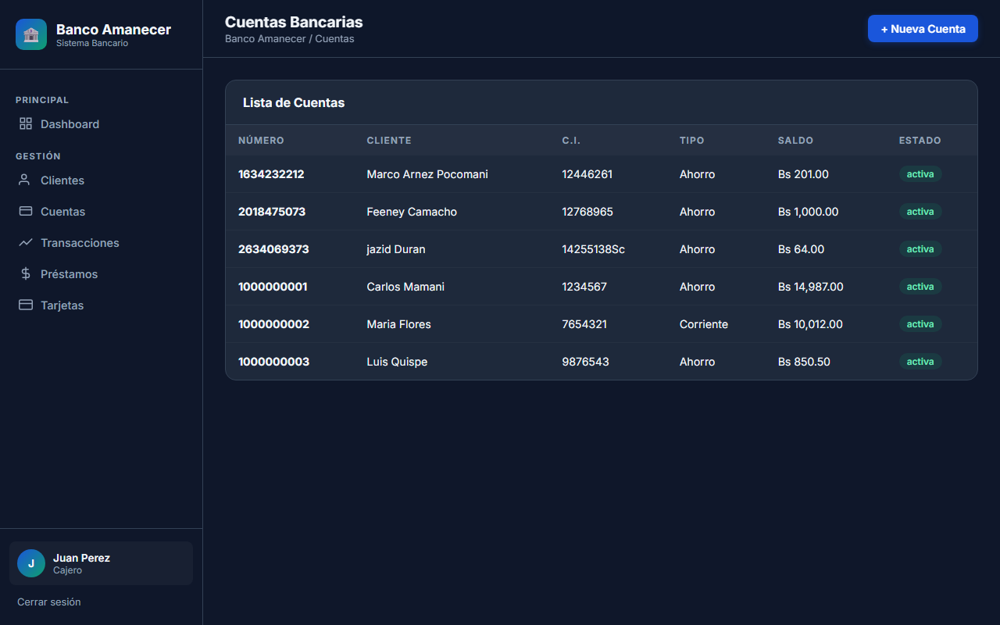

<div align="center">
  

  <h1>🌅 Banco Amanecer</h1>
  <p><strong>Un Sistema Bancario Moderno, Escalable y Seguro</strong></p>

  <p>
    
    
    
    
    
  </p>
</div>

---

## 📖 Acerca del Proyecto

**Banco Amanecer** es una plataforma de gestión bancaria desarrollada con el patrón arquitectónico **MVC (Modelo-Vista-Controlador)** en Python/Flask. Está diseñada para ofrecer una interfaz fluida, interactiva y de aspecto premium para el personal interno del banco (Cajeros y Administradores).

## ✨ Características Principales

- 📊 **Panel de Control Interactivo**: Visualización gráfica (Chart.js) en tiempo real de los saldos y volúmenes de transacciones.
- 👥 **Gestión de Clientes**: Creación y administración de perfiles detallados de clientes.
- 💳 **Cuentas y Tarjetas**: Administración de cuentas de ahorro/corriente y emisión de tarjetas.
- 💸 **Transacciones Financieras**: Sistema robusto para depósitos, retiros y transferencias entre cuentas.
- 🏦 **Módulo de Préstamos**: Flujo completo de solicitud, aprobación, y cálculo de plan de pagos en cuotas.
- 🔒 **Roles y Permisos**: Accesos diferenciados. Los Administradores tienen acceso total (incluyendo el registro de **Auditoría**), mientras que los Cajeros tienen un acceso operativo.

---

## 📸 Capturas de Pantalla

### 🛡️ Vista de Administrador
<div align="center">
  
  
  <br>
  
  
</div>

### 🧑‍💼 Vista de Cajero
<div align="center">
  
  
</div>

---

## 🚀 Instalación y Uso Local

Sigue estos pasos para ejecutar el sistema en tu propio computador:

1. **Clonar el repositorio:**
   ```bash
   git clone https://github.com/jazidovandod-gif/Banco_Amanecer.git
   cd Banco_Amanecer
   ```

2. **Instalar las dependencias:**
   Asegúrate de tener Python instalado y ejecuta:
   ```bash
   pip install -r requirements.txt
   ```

3. **Configurar la Base de Datos:**
   - Instala y ejecuta **MySQL** (por ejemplo, a través de XAMPP).
   - Crea la base de datos importando el archivo `database.sql`:
     ```bash
     mysql -u tu_usuario -p < database.sql
     ```
   - *Nota:* Asegúrate de actualizar tus credenciales de MySQL en `config/config.py`.

4. **Ejecutar la aplicación:**
   ```bash
   python app.py
   ```

5. **Acceder:**
   Abre tu navegador y ve a `http://127.0.0.1:5000`. Puedes iniciar sesión con los usuarios por defecto:
   - Administrador: `admin` / `admin123`
   - Cajero: `jperez` / `cajero123`

---

## 📂 Arquitectura del Proyecto (MVC)

El proyecto mantiene una estricta separación de responsabilidades:
- `config/`: Credenciales y configuración del entorno.
- `database/`: Capa física de conexión a MySQL.
- `crud/` (Modelo): Consultas SQL e interacciones con los datos.
- `routes/` (Controladores): Blueprints de Flask que manejan el flujo HTTP.
- `templates/` & `static/` (Vistas): Interfaz HTML estilizada con CSS puro.

---
<div align="center">
  <i>Desarrollado con pasión para transformar las finanzas.</i>
</div>
